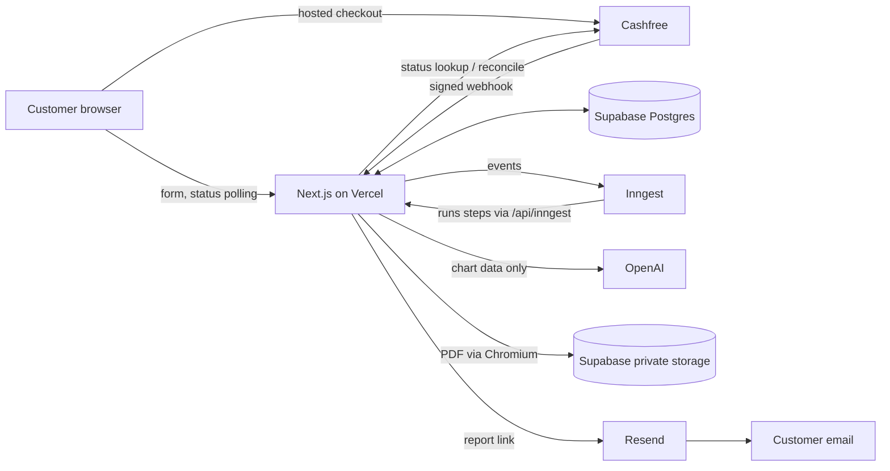

# Architecture

A modular monolith: one Next.js application with clear internal boundaries, deployed to
Vercel, using managed services for the parts that must be reliable.

## Key design decisions

| Decision | Why |
| --- | --- |
| Built-in chart engine on Astronomy Engine (MIT) | No per-chart API cost or licence risk (Swiss Ephemeris is AGPL/commercial). Behind `CalculationProvider`, so a licensed engine or API can replace it. |
| AI writes prose only, from structured facts | Positions are never invented; output is schema-validated, versioned and stored once. |
| Report split into 3 AI parts, stored separately | Each call fits time/token limits; retries never pay twice for finished parts. |
| Chromium for PDFs | Only a real browser engine shapes Tamil/Indic scripts correctly; verified per language. |
| Outbox + Inngest | A verified payment and its work are committed together; Inngest retries each step durably. A 10-minute sweeper recovers missed webhooks, lost dispatches and stalled jobs. |
| No accounts; token links | Simplest safe model for a one-off purchase; tokens hashed, expiring, recoverable by email. |
| Postgres as source of truth, Excel as export | Transactions and constraints protect money; the owner still gets spreadsheets. |
| PGlite for demo and tests | Real PostgreSQL semantics without installing a database. |

## Capacity: launch limits and upgrade points

No load test has been run; these are engineering estimates, not guarantees.

- **Web requests** are stateless and scale with Vercel automatically.
- **Report generation** is limited by `REPORT_CONCURRENCY` (default 3 at a time) to stay
  within AI rate limits and cost; each report takes roughly 1-5 minutes (mostly AI time),
  so the default comfortably handles dozens of orders an hour. Raise the concurrency as
  your OpenAI rate limits and Inngest plan allow.
- **Database**: indexed lookups; the Supabase free/entry tier is fine for launch. Upgrade
  for backups/PITR and when connections or storage grow.
- **Upgrade points**, roughly in order: Supabase paid plan (backups), Vercel Pro
  (commercial use), Inngest paid plan (more concurrency/steps), OpenAI usage tier, Redis
  for rate limiting, a hosted browser service for PDFs if cold starts become slow.
- **Costs to watch**: AI tokens per report (see Excel export), Vercel function time for
  PDFs, email volume.

## Where to change things

| Change | File |
| --- | --- |
| Prices | `src/config/pricing.ts` |
| Languages offered | `src/config/languages.ts` (+ `src/i18n/<code>.ts`) |
| Report wording / labels | `src/i18n/*.ts` |
| AI instructions | `src/server/interpretation/prompt-v1.ts` (bump `PROMPT_VERSION`) |
| Report layout / PDF styling | `src/server/reports/render.ts`, `pdf.ts`, `chart-svg.ts` |
| Hero artwork | `src/config/hero-media.ts` (see HERO_ASSETS.md) |
| Policy pages | `src/app/privacy`, `terms`, `refund-policy`, `delivery-policy`, `contact` |
